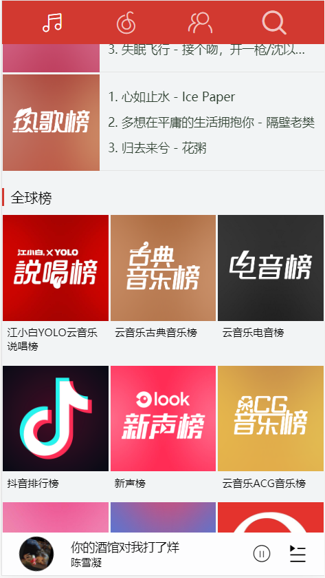
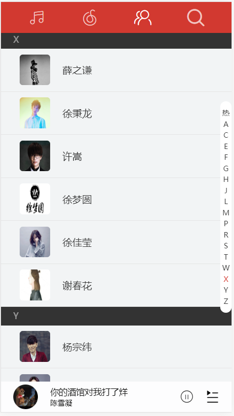
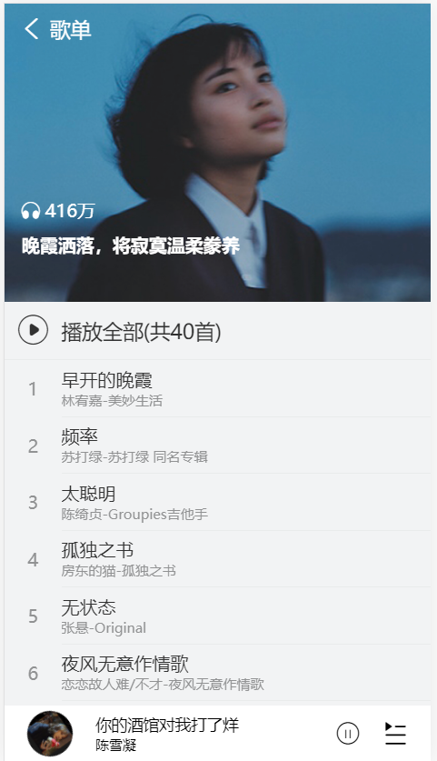
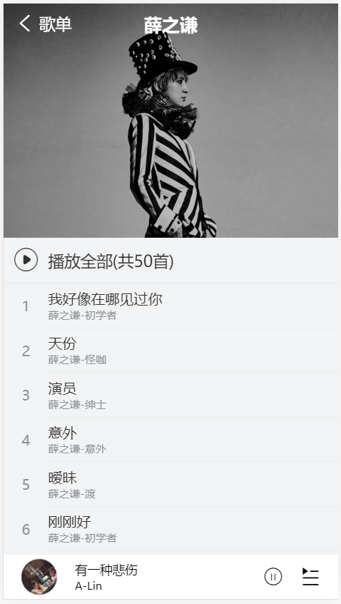
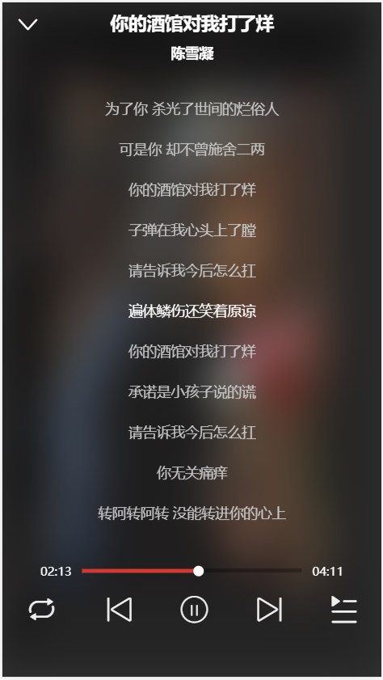
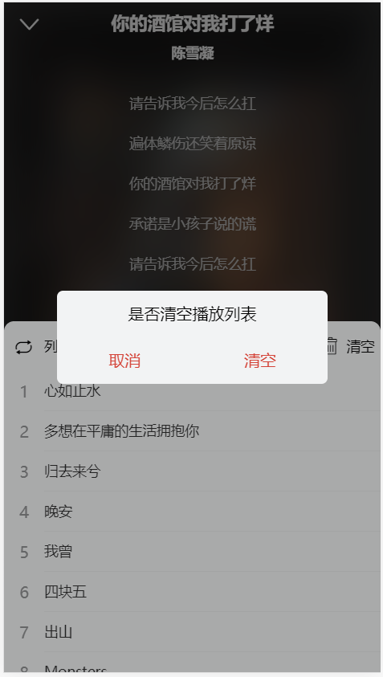
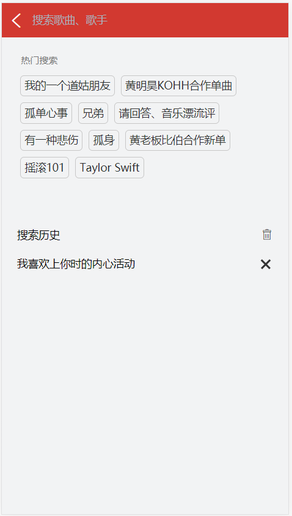
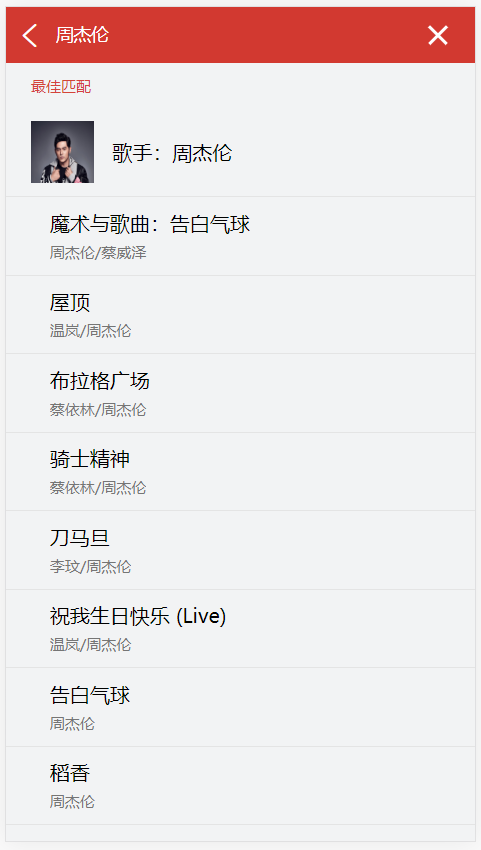

# Vue(2.6) 仿安卓端网易云音乐

## 后端接口

> 该项目通过调用[网易云音乐NODE版](https://github.com/Binaryify/NeteaseCloudMusicApi)接口，运行该项目需要在本地启动测试接口

## 安装依赖
```
npm install
```

## 开发环境运行项目
```
npm run serve
```

## 预览

### 推荐页面、排行榜页面、歌手分类页面
<table align="center">
    <tr>
        <td></td>
        <td></td>
        <td></td>
    </tr>
</table>

### 歌单详情页、歌手详情页
<table align="center">
    <tr>
        <td></td>
        <td></td>
    </tr>
</table>

### 播放页面、歌词页面、清空播放列表
<table align="center">
    <tr>
        <td></td>
        <td></td>
        <td></td>
    </tr>
</table>

### 搜索页面、搜索结果
<table align="center">
    <tr>
        <td></td>
        <td></td>
    </tr>
</table>

## 技术栈

* `Vue` : 用于构建用户界面的MVVM框架
* `Vue-router` : 为单页面应用提供路由跳转功能
* `Vuex` : 集中数据状态管理仓库
* `Vue-lazy` : 用户解决图片懒加载问题
* `Better-scroll` : 提供更好的移动端滚动体验
* `fastclick` : 解决移动端点击事件300ms延迟问题
* `Scss` : CSS预处理器，更优雅的书写CSS
* `ES6` : 更优雅的书写JS，模块化导入导出
* `iconfont` : 阿里巴巴字体图标库
* `ESlint` : 代码规范检查
* `Axios` : 用于请求服务端数据
* `NeteaseCloudMusicApi` : 第三方开源网易云音乐接口，用于获取动态数据和音乐资源
* `Vue-cli` : 脚手架工具，减少开发配置时间
* `Pinyin` : 将歌手按姓名拼音首字母分类
* `good-storage` : 更方便的操作LocalStorage
* `lyric-paser` : 格式化歌词
